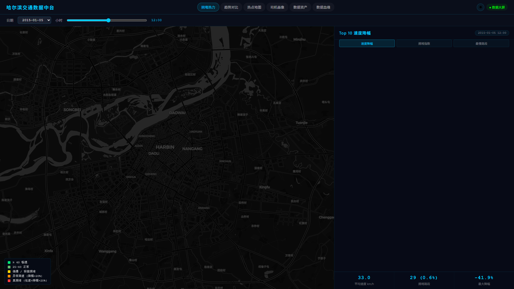
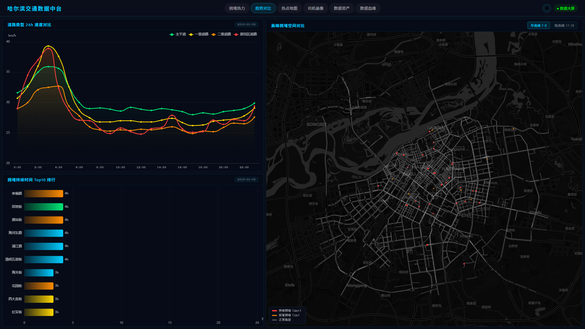
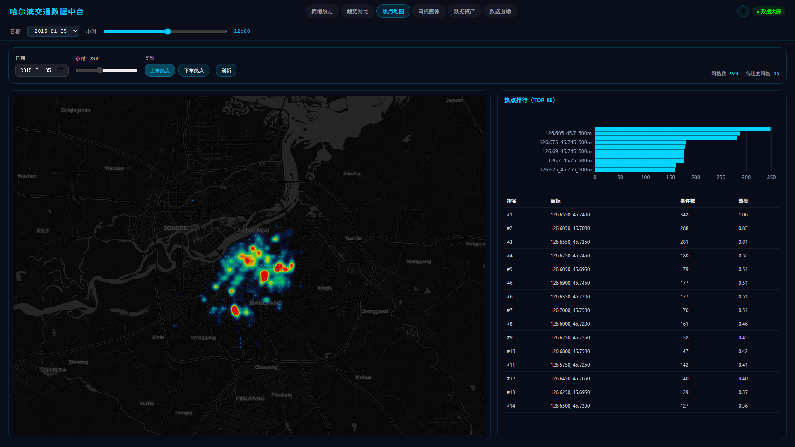
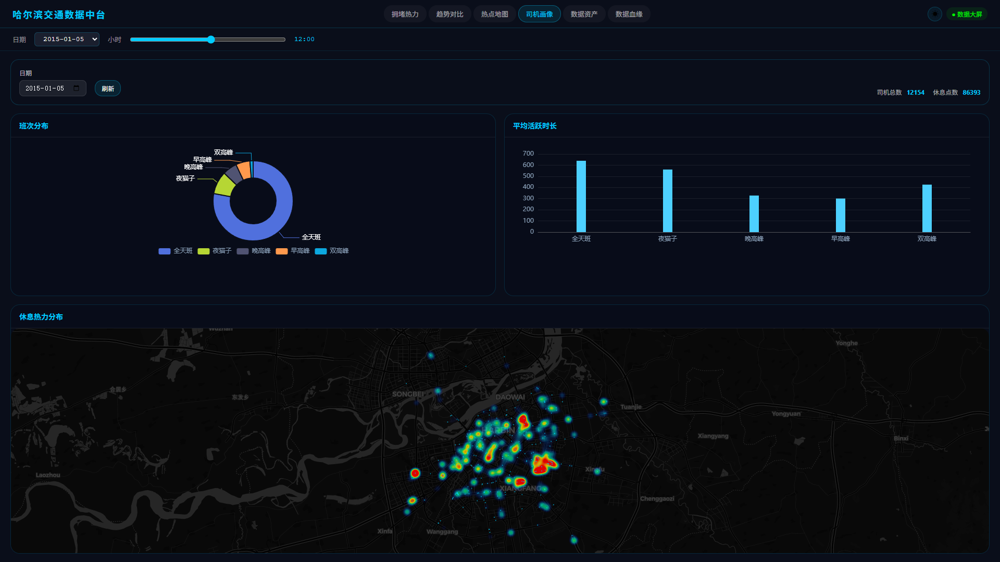
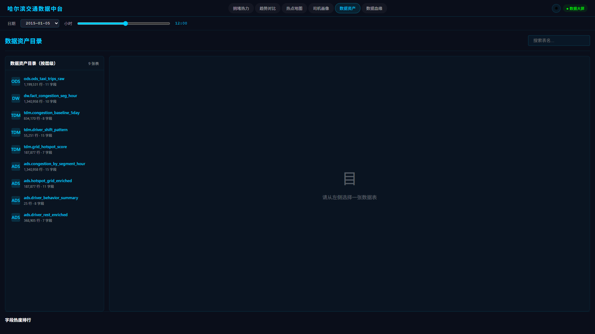
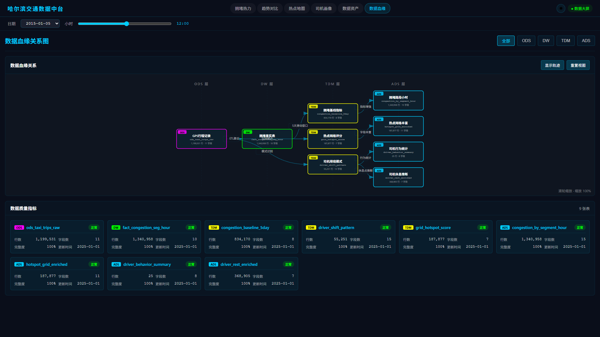

# 哈尔滨交通数据中台

基于出租车 GPS 轨迹数据的离线处理与在线可视化平台，包含 6 页数据大屏，覆盖拥堵分析、热点检测、司机画像、数据资产管理和数据血缘追踪。

## 技术栈

| 层 | 技术 |
|----|------|
| 后端 | Java 17、Spring Boot 3.2、JdbcTemplate、Caffeine 缓存 |
| 前端 | Vue 3、Vite 5、Pinia、ECharts 6、MapLibre GL 4.7、deck.gl 8.9 |
| 数据库 | PostgreSQL 15.4 + PostGIS 3.3.4 |
| 离线处理 | Julia (LibPQ + DataFrames) |

## 项目结构

```
├── backend/                    # Spring Boot 后端
│   └── src/main/java/.../
│       ├── controller/         # REST API 控制器
│       ├── service/            # 业务逻辑层
│       ├── repository/         # SQL 查询层
│       ├── dto/                # 数据传输对象
│       ├── config/             # 缓存、索引等配置
│       └── resources/
│           ├── application.yml
│           ├── ddl-dashboard.sql   # ADS 表建表语句
│           └── ddl-indexes.sql     # 索引自动创建
├── frontend/                   # Vue 3 前端
│   └── src/
│       ├── pages/              # 7 个页面组件
│       ├── layouts/            # 大屏布局（导航栏+时间轴）
│       ├── components/         # 地图组件
│       ├── services/           # API 调用封装
│       ├── stores/             # Pinia 状态管理
│       └── utils/              # ECharts 暗色主题
├── scripts/                    # ETL 和运维脚本
│   ├── fill_congestion_ads.py  # 拥堵数据 ETL
│   ├── fill_hotspot_driver_ads.py  # 热点+司机数据 ETL
│   ├── start-backend.ps1       # 启动后端
│   └── stop-backend.ps1        # 停止后端
└── julia/                      # Julia 离线处理脚本
    ├── driver_rest_etl.jl      # 司机休息点推断
    ├── mapmatch.jl             # 地图匹配
    └── traffic.jl              # 交通流计算
```

## 数据大屏页面

### 拥堵热力图（`/congestion`）

路段拥堵热力图 + Top10 排行 + 道路类型统计



### 趋势对比（`/trend`）

5 天速度趋势 + 工作日/节假日对比



### 热点地图（`/hotspot`）

上下车热点切换 + 网格排行



### 司机画像（`/driver`）

班次分布 + 活跃时长 + 休息点地图



### 数据资产（`/catalog`）

4 层数据表浏览 + 字段详情 + 数据查询



### 数据血缘（`/lineage`）

ODS→DW→TDM→ADS 血缘 DAG + 数据质量卡片



## 数据库分层

```
ODS（原始层）
  └─ ods_taxi_trips_raw          120万行 GPS 轨迹
       │
       ├──ETL聚合──→ DW（维度建模层）
       │              └─ fact_congestion_seg_hour    134万行
       │                    │
       │                    └──5天窗口──→ TDM（算法模型层）
       │                                    ├─ congestion_baseline_5day   83万行
       │                                    ├─ driver_shift_pattern      5.5万行
       │                                    └─ grid_hotspot_score        19万行
       │                                          │
       │                                          └──指标增强──→ ADS（应用展示层）
       │                                                        ├─ congestion_by_segment_hour  134万行
       │                                                        ├─ hotspot_grid_enriched       19万行
       │                                                        ├─ driver_behavior_summary     25行
       │                                                        └─ driver_rest_enriched        37万行
       │
       └──空间聚合──→ TDM → ADS（热点链路）
       └──模式识别──→ TDM → ADS（司机链路）
```

所有大屏查询只读取 ADS 层表，符合数据中台分层架构。

数据范围：2015-01-03 ~ 2015-01-07（哈尔滨市区，共 5 天）。

## 快速启动

```powershell
# 1. 启动后端（默认端口 8082）
powershell -ExecutionPolicy Bypass -File .\scripts\start-backend.ps1 -KillPortOwner

# 2. 启动前端
cd frontend
npm install
npm run dev

# 3. 访问
# http://localhost:5173/congestion   ← 大屏首页
# http://localhost:5173/map          ← 原始轨迹地图
```

## 部署说明

后端通过环境变量配置数据库连接，需在启动前设置：

| 环境变量 | 说明 | 默认值 |
|----------|------|--------|
| `DB_URL` | JDBC 连接地址 | `jdbc:postgresql://localhost:5432/postgres` |
| `DB_USER` | 数据库用户名 | `postgres` |
| `DB_PASS` | 数据库密码 | `postgres` |

PowerShell 示例：

```powershell
$env:DB_URL  = "jdbc:postgresql://你的地址:5432/数据库名"
$env:DB_USER = "用户名"
$env:DB_PASS = "密码"
```

此外需确保数据库已安装 PostGIS 扩展，并按 `backend/src/main/resources/ddl-dashboard.sql` 创建 ADS 层表结构。


